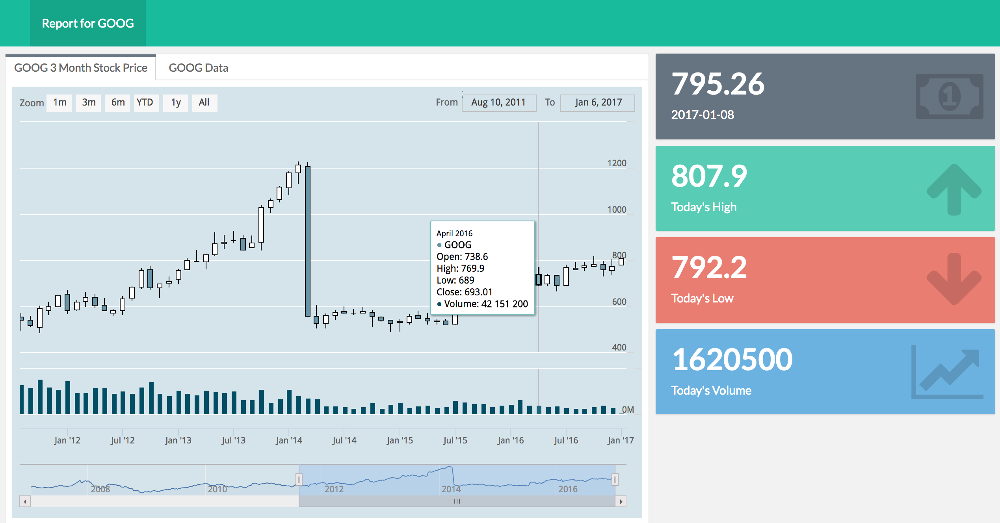

```{r setup, include=FALSE}
knitr::opts_chunk$set(message = FALSE)
```


# Dynamic and interactive documents

## Interactive documents

The perspectives in this session share some really important goals:

Letting people see data 

Letting people explore data

Facilitating decisions and insights via data


# htmlwidgets: The Power of Packages

## Packages {.build}

The Open Source R community writes packages that enable users to **do more but code less**.

Almost everything today take a couple of lines of code.

You no longer have to be a programmer to use R.

Packages are rapidly expanding R's capabilities.

## A growing community


## Web-native visualisations

<br>

There are a growing number of R packages that make it easy to create interactive/web native visualisations.

Many of these are based on a framework called **htmlwidgets**.

## Leaflet

```{r message=FALSE}
library(leaflet); library(dplyr)

leaflet() %>% addTiles() %>% fitBounds(0, 40, 10, 50)
```

## networkD3

```{r}
library(networkD3); data(MisLinks); data(MisNodes)

forceNetwork(Links = MisLinks, Nodes = MisNodes, Source = "source",
             Target = "target", Value = "value", NodeID = "name",
             Group = "group", opacity = 0.7, zoom = TRUE)
```

## dygraphs

```{r}
library(dygraphs)
dygraph(nhtemp, main = "New Haven Temperatures") %>%
    dyRangeSelector(dateWindow = c("1920-01-01", "1960-01-01"))
```

## DT

```{r}
library(DT)
datatable(iris, options = list(pageLength = 5))
```

# Static dashboards

## What is a dashboard?

<br>
<br>
<br>
Dashboards provide an **overview** of key data.

<br>

The [flexdashboard](http://rmarkdown.rstudio.com/flexdashboard/) R package allows you to easily create dashboards with [R Markdown](http://rmarkdown.rstudio.com/).

## For example . . .



# Serving Shiny

## Hosting through shinyapps.io

1. Create a [shinyapps.io](http://www.shinyapps.io/) account and follow sign up instructions.

2. After **running** your shiny app, click on *Publish* > *Publish Document...* in the output viewer.

3. In the resulting pop-up box connect your ShinyApps.io account following the onscreen instructions and **publish**.


## Hosting through IQSS

**If data cannot leave Harvard servers**, then IQSS/VPAL maintain a Shiny Server

Key features include Harvard Key authentication and support for up to level 3 data security.

# Institutional Considerations

## Researchers

When working with data, need to use **reproducible code**

Need to make data **transparent**

Tools for ex ante (e.g., power analysis) / ex post investigations (e.g., outliers)

Promotion of work!

## Staff/Administration

As an institution we generate tons of data. 

Across the University much data is managed by **old spreadsheet practices**

And databases/reporting/visualization tools are **separated** from data science tools

<br>

We are **not** ok with that in research, should we revisit this in other places?

R easily integrates with **modern databases** (SQL etc.)

99.9% of what you saw today is **free**.

## Students

Our students are learning R in their classes

R is now one of the most sought after programming language/we are in the era of big data

They could help us transform our **UniveRsity** and **Research** practices.

 
