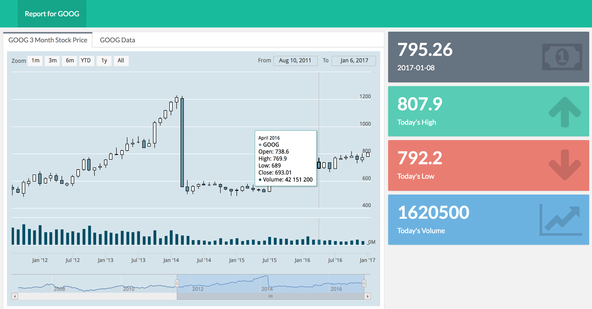
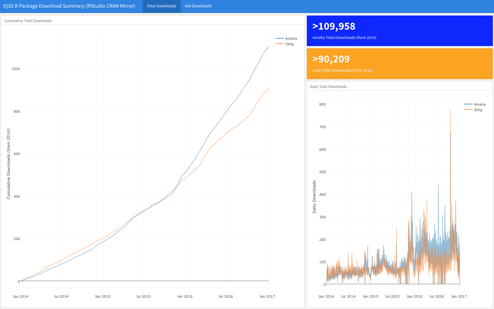
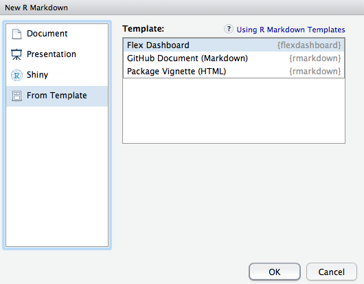
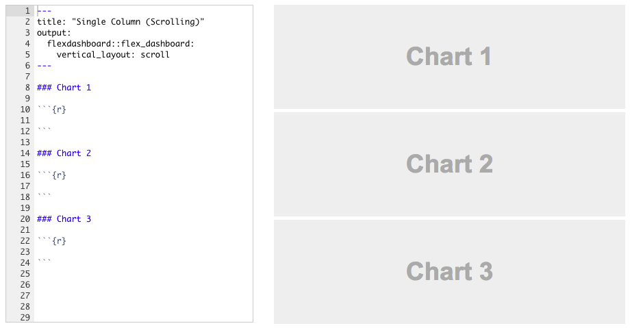
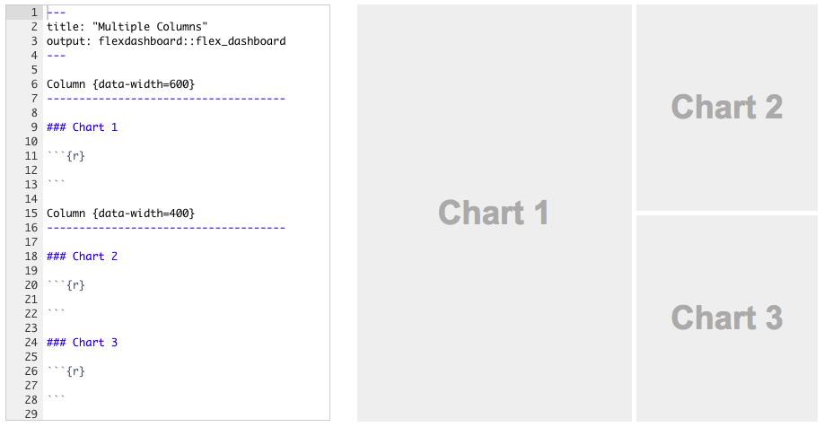

```{r setup, include=FALSE}
knitr::opts_chunk$set(message = FALSE)
```

## Following along

<br>
<br>
<br>

This slide deck is available at: [GET].

## Acknowledgements

<br>
<br>
<br>

Thanks so much to Garrett Grolemund and RStudio for providing us with helpful suggestions and examples, some of which we've included here.

## About you

<br>
<br>
<br>

Complete the survey: <https://goo.gl/forms/b0UuRnpxpfjwpiD93>

## Prerequisits

- Basic familiarity with R (e.g. can install packages, source files, and so on). 

- Familiarity with R Markdown would be a benefit.

- Have a laptop with the following software installed:

    + R and RStudio

    + `rmarkdown`, `flexdashboard`, and `shiny` packages for R

- Working internet connection


# Dynamic documents


# R Markdown to HTML


# htmlwidgets

## Web-native visualisations

<br> 

There are a growing number of R packages that make it easy to create interactive/web native visualisations.

Many of these are based on a framework called **htmlwidgets**.

## Leaflet

```{r message=FALSE}
library(leaflet); library(dplyr)

leaflet() %>% addTiles() %>% fitBounds(0, 40, 10, 50)
```

## networkD3

```{r}
library(networkD3); data(MisLinks); data(MisNodes)

forceNetwork(Links = MisLinks, Nodes = MisNodes, Source = "source",
             Target = "target", Value = "value", NodeID = "name",
             Group = "group", opacity = 0.7, zoom = TRUE)
```

## dygraphs

```{r}
library(dygraphs)
dygraph(nhtemp, main = "New Haven Temperatures") %>% 
    dyRangeSelector(dateWindow = c("1920-01-01", "1960-01-01"))
```

## DT

```{r}
library(DT)
datatable(iris, options = list(pageLength = 5))
```

# Static dashboards

## What is a dashboard?

<br>
<br>
<br>
Dashboards provide an **overview** of key data.

<br>

The [flexdashboard](http://rmarkdown.rstudio.com/flexdashboard/) R package allows you to easily create dashboards with [R Markdown](http://rmarkdown.rstudio.com/). 

## For example . . .



## For example . . .



## Getting started

Once you have the flexdashboard package installed, in RStudio select `File` > `New File` > `R Markdown...`. Then, select `Flex Dashboard` from the `From Template` new R Markdown type:



## Basic flexdashboard syntax: Header

Like other R Markdown documents, flexdashboards start with a [YAML](http://yaml.org/) header. E.g.:

```
---
title: "DataFest 2017 | Intro to dynamic web documents"
author: "Christopher Gandrud & Justin Tingley"
date: "18 January 2017"
output:
    ioslides_presentation:
        css: datafest_slides.css
        logo: img/iqss_logo_flat.png
---
```

## Basic flexdashboard syntax: Rows

Dashboard rows are delimited by the 3rd level markdown header: `###`.



## Basic flexdashboard syntax: Columns

Separate columns are delimited with `-------------------`



# Dynamic + Interactive Shiny Documents 


# Dynamic + Interactive Dashboards 


