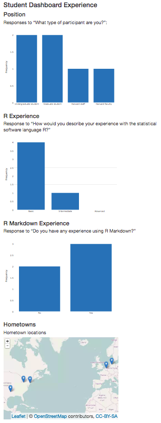
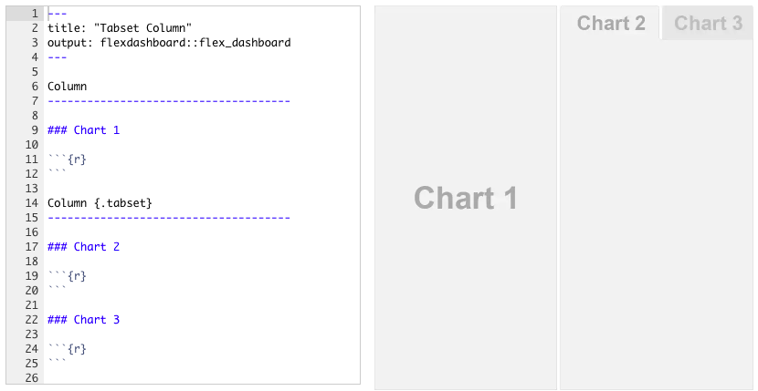
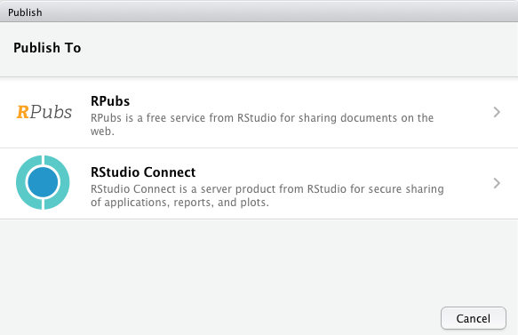
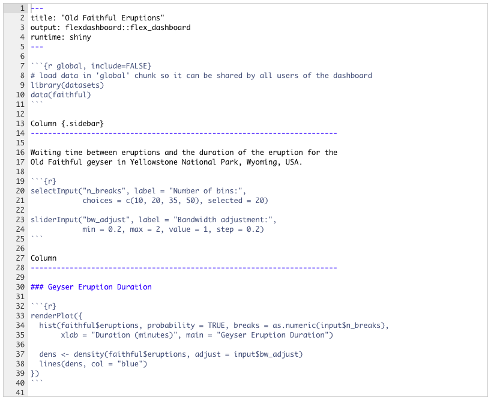
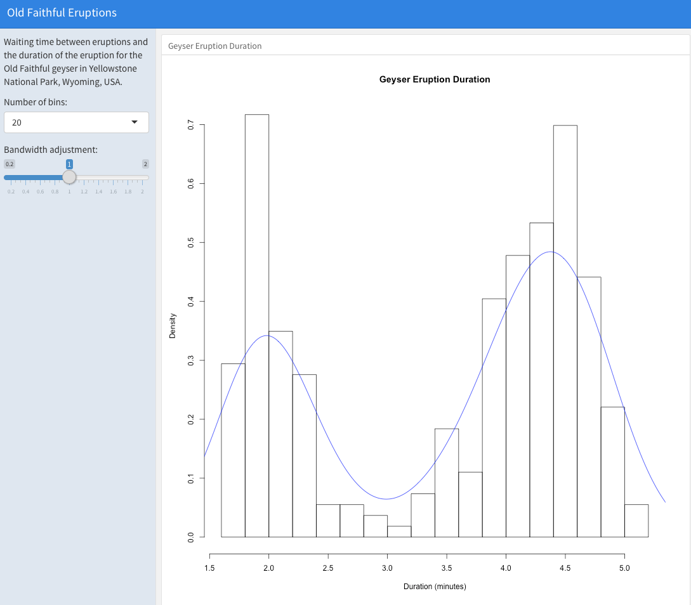
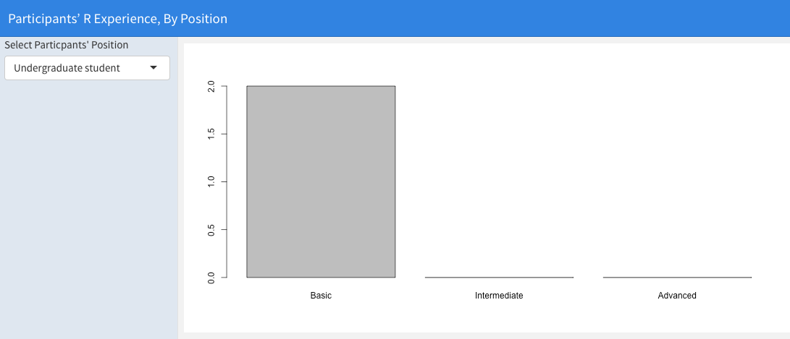

```{r setup, include=FALSE}
knitr::opts_chunk$set(message = FALSE)
```

## Following along

<br>
<br>
<br>

This slide deck is available at: [GET].

## Acknowledgements

<br>
<br>
<br>

Thanks so much to Garrett Grolemund and RStudio for providing us with helpful suggestions and examples, some of which we've included here.

## About you

<br>
<br>
<br>

Complete the survey: <https://goo.gl/forms/b0UuRnpxpfjwpiD93>

## Prerequisits

- Basic familiarity with R (e.g. can install packages, source files, and so on). 

- Familiarity with R Markdown would be a benefit.

- Have a laptop with the following software installed:

    + R and RStudio

    + `rmarkdown`, `flexdashboard`, and `shiny` packages for R

- Working internet connection


# Dynamic and interactive documents

## Interactive documents

When your output documents are in **HTML**, you can create interactive
visualisations.

Potentially--though not always--more engaging and could let users explore data 
on their own.

## Big distinction:

**Client Side**: HTML documenst are rendered on the user's (client's) computer. Often
**JavaScript in the browser**. You simply send them static HTML/JavaScript needed for
their browser to create the plots. Could be sent from a services such as [RPubs](https://rpubs.com/).

**Server Side**: Data manipulations and/or plots (e.g. with [shinyapps](https://www.shinyapps.io/)) are
done on a **server in R**. Browsers don't come with R built in.

## FILL IN

[DUSTIN FILL IN]

# R Markdown to HTML

## R Markdown Review

<br> 
You can use R Markdown to create HTML documents.

See <http://rmarkdown.rstudio.com/> for an introduction to R Markdown.

## Display code chunks refresh

Use three back-ticks (```) to **start** and **end** a code chunk that is **not run**.

To create a **knit-able** code chunk begin the chunk with ````{r}`. Close the chunk with another three ticks.

## Chunk options

Change how R Markdown chunks behave with **options**. Place
options in the chunk head: ````{r echo=FALSE, error=FALSE}`

| Option          | What it Does                                               |
| --------------- | ---------------------------------------------------------- |
| `echo=FALSE`    | Does not print the code only the output                    |
| `error=FALSE`   | Does not print errors                                      |
| `include=FALSE` | Does not include the code or output, but does run the code |
| `fig.width`     | Sets figure width                                          |
| `cache=TRUE`    | Cache the chunk. It is only run when the contents change.  |

Many others at <http://yihui.name/knitr/options>


## R Markdown header

The key is to declare `html_document` in the header. E.g.:

```
output:
    html_document
```

## Simple example:

<br>
<br>
<br>

For example, we can summarise the survey data using: <http://tinyurl.com/jx4gty2>.

Which downloads your survey data from Google Sheets and creates . . .

## Static HTML example results



## Do . . . 

<br>
<br>

Copy the code at <http://tinyurl.com/jx4gty2> used to create the survey summary document. 

**Add an additional code chunk plotting** responses to the question "Have you ever built a 'data dashboard'?"


# htmlwidgets

## Web-native visualisations

<br> 

There are a growing number of R packages that make it easy to create interactive/web native visualisations.

Many of these are based on a framework called **htmlwidgets**.

## Leaflet

```{r message=FALSE}
library(leaflet); library(dplyr)

leaflet() %>% addTiles() %>% fitBounds(0, 40, 10, 50)
```

## networkD3

```{r}
library(networkD3); data(MisLinks); data(MisNodes)

forceNetwork(Links = MisLinks, Nodes = MisNodes, Source = "source",
             Target = "target", Value = "value", NodeID = "name",
             Group = "group", opacity = 0.7, zoom = TRUE)
```

## dygraphs

```{r}
library(dygraphs)
dygraph(nhtemp, main = "New Haven Temperatures") %>% 
    dyRangeSelector(dateWindow = c("1920-01-01", "1960-01-01"))
```

## DT

```{r}
library(DT)
datatable(iris, options = list(pageLength = 5))
```

# Static dashboards

## What is a dashboard?

<br>
<br>
<br>
Dashboards provide an **overview** of key data.

<br>

The [flexdashboard](http://rmarkdown.rstudio.com/flexdashboard/) R package allows you to easily create dashboards with [R Markdown](http://rmarkdown.rstudio.com/). 

## For example . . .


## For example . . .


## Getting started

Once you have the flexdashboard package installed, in RStudio select `File` > `New File` > `R Markdown...`. Then, select `Flex Dashboard` from the `From Template` new R Markdown type:


## Basic flexdashboard syntax: Header

Like other R Markdown documents, flexdashboards start with a [YAML](http://yaml.org/) header. E.g.:

```
---
title: "DataFest 2017 | Intro to dynamic web documents"
author: "Christopher Gandrud & Dustin Tingley"
date: "18 January 2017"
output:
    ioslides_presentation:
        css: datafest_slides.css
        logo: img/iqss_logo_flat.png
---
```

## Basic flexdashboard syntax: Rows

Dashboard rows are delimited by the 3rd level markdown header: `###`.


## Basic flexdashboard syntax: Columns

Separate columns are delimited with `Column` followed by `-------------------`. Column widths can be set in the section heading with the `data-width` attribute.


## Tabbed pages

You can create multi-page dashboards by placing the table label followed by, on a new line, `======================`. E.g.

```
Net Downloads
===========================================
```


## Tabsets

Adding `.tabset` to a section heading can create tabs within a specific section.



## Do . . .

We could make a dashboard from the hometowns you provided.

Here's an example (using fake data): <http://tinyurl.com/hgk3fxx>

<br>
<br>

**You:** make a similar dashboard using R source code available at: <http://tinyurl.com/zwszswb>

Hint: it's typically good practice to place **setup code** in a separate chunk just under the header, with the code chunk option `include=FALSE`.

## Full code

<br>
<br> 

Full code for the exercise can be found: <http://tinyurl.com/zwk5het>.

## Hosting documents created on the client-side

## Hosting client-side rendered HTML

There are lots of **free** services (e.g. RPubs, GitHub Pages) for hosting webpages for
client side plot rendering.

## Hosting through RPubs

1. Create an [RPubs](https://rpubs.com/) account.

2. After **knitting** an R Markdown document to HTML, click on *Publish* > *Publish Document...* in the output viewer. 

3. In the resulting pop-up box, click *RPubs* > *Publish*



## RPubs dashboard example

<br>
<br>

For example: <http://rpubs.com/christophergandrud/datafest_ex_dashboard>.

Note: RPubs documents do not update when new data is available. It is a static file host.

# Dynamic + Interactive Shiny Documents 

## Show and tell

[Dustin]

# Dynamic + Interactive Dashboards 

## Shiny flexdashboards

1. Add `runtime: shiny` to the YAML header options to declare the dashboard a shiny flexdashboard.

2. Add a `{.sidebar}` attribute to the first column in the dashboard. This is where we will place the controls.

3. Add Shiny [inputs](http://shiny.rstudio.com/tutorial/lesson3/) and [outputs](http://shiny.rstudio.com/tutorial/lesson4/).

## Shiny dashboard example



Source: <http://rmarkdown.rstudio.com/flexdashboard/shiny.html>

## Result



## Syntax breakdown: Inputs

```{r eval=FALSE}
selectInput("n_breaks", label = "Number of bins:",
            choices = c(10, 20, 35, 50), selected = 20)

sliderInput("bw_adjust", label = "Bandwidth adjustment:",
            min = 0.2, max = 2, value = 1, step = 0.2)
```

Creates **two elements in** a new `input` object: `n_breaks` and `bw_adjust`.

## Syntax breakdown: Outputs

`input` is passed to the output code in `renderPlot`:

```{r eval=FALSE}
renderPlot({
    hist(faithful$eruptions, probability = TRUE, 
         breaks = as.numeric(input$n_breaks),
         xlab = "Duration (minutes)", 
         main = "Geyser Eruption Duration")
    
    dens <- density(faithful$eruptions, adjust = input$bw_adjust)
    lines(dens, col = "blue")
})
```

## Do . . . 

Create a new shiny dashboard that **subsets** our Google Sheets survey data based on participants **position** (e.g. "undergraduate", "faculty") and returns a bar plot of the subset's **R skill level**.

R code available at: <http://tinyurl.com/hwp5pgf>

## Result




# Institutional considerations

[DUSTIN FILL IN]

# Serving Shiny Documents

## Hosting through shinyapps.io

1. Create a [shinyapps.io](http://www.shinyapps.io/) account and follow sign up instructions.

2. After **running** your shiny app, click on *Publish* > *Publish Document...* in the output viewer. 

3. In the resulting pop-up box connect your ShinyApps.io account following the onscreen instructions and **publishe**.


